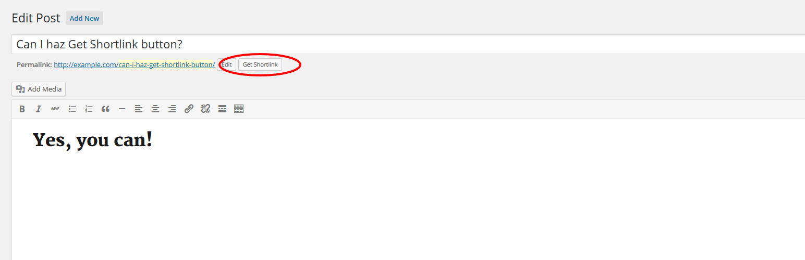

# Bring Back the Get Shortlink Button

> This plugin brings back the Get Shortlink button, which is hidden by default since WordPress 4.4.
---

As of WordPress 4.4, the _Get Shortlink_ button is hidden by default. This plugin brings it back. Yay.

Please note that the button does not exist at all in a Block Editor context. It will only show up when using the Classic Editor, for example, when editing a single attachment.

## Installation

1. [Download ZIP](https://github.com/tfrommen/bring-back-the-get-shortlink-button/archive/main.zip).
1. Upload contents to the `/wp-content/plugins` directory on your web server.
1. Activate the plugin through the _Plugins_ menu in WordPress.
1. Find the _Get Shortlink_ button just where it was before WordPress 4.4.
